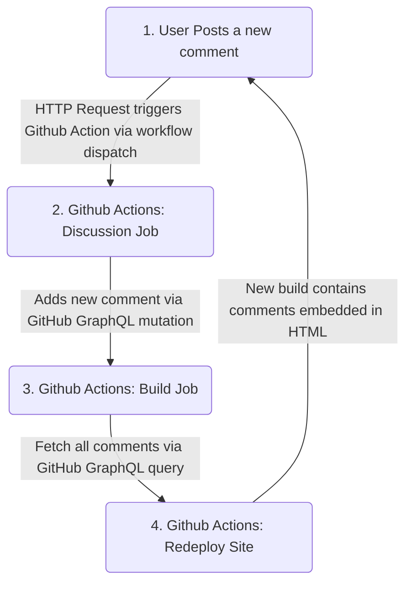
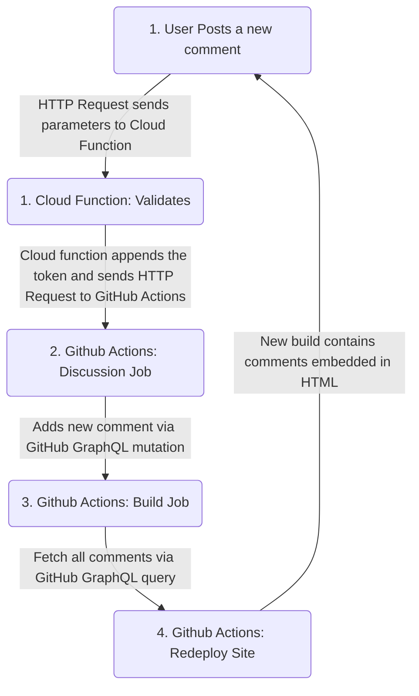

This is the first of a two part series where I talk through a recent side project that uses [GitHub Discussions](https://docs.github.com/en/discussions) as a datastore for blog comments.

**Part One:** Focuses on getting the data into GitHub from the browser
**[Part Two](/blog/gatsby-comments-github-discussions-part-2/):** Focuses on pulling the new data out at build time and rebuilding the site.

## Why are you doing this?

The idea of generating html files on the fly, a process we often call [static site rendering](https://www.smashingmagazine.com/2020/07/differences-static-generated-sites-server-side-rendered-apps/), has always appealed to me. There are some real practical benefits, hosting is simple and cheap, response times are super quick, search engine optimisation is straightforward. There are of course some downsides, one of those being when you have to deal with dynamic or user generated data. A prime example being comments hosted on a blog.

For this blog I use Gatsby. It would be overkill for many blogs, however this is also where I intend to play around with a few code projects. Under the hood Gatsby harnesses the power of React and GraphQL. This provides a good toolkit for progressing beyond straight forward blogging. I use [Github Actions](https://github.com/features/actions) for the build process and host the output on [Github Pages](https://pages.github.com/). The GitHub ecosystem integrates nicely together, I also like the pace of change with new features rolling out all the time.

I'm hoping to provide a slow but steady output of blog posts. I would love to hear what people think about what I have written.
There are a load of [Gatsby plugins](https://www.gatsbyjs.com/docs/how-to/adding-common-features/adding-comments/) out there for dealing with comments. Lots of them are very comprehensive and I recommend checking them out before embarking on something like this. For me, none of the plugins quite ticked all of the boxes.

These were the main critera I was looking for.
- **No Cookies:** This site doesn't have any cookies and it doesn't need any, I'd like it to stay that way.
- **No Auth:** I don't want people to have to login to another provider or create an account just to write a comment.
- **Full html/css control:** I want the comments to look like they are a first class part of the site.
- **No Cost:** The only thing I pay for on this site is cookie free analytics via [Plausible.io](Plausible.io).
- **No Extra Providers:** The Github Ecosystem does most of what I need from one interface.

## What is the plan?

I'd heard about people using GitHub Issues as a datastore for comments. This sounds like a neat idea, only I think it makes more sense to use GitHub Discussions, after all semantically it's more correct. If I was doing this in the work place I would do lots of upfront planning and research. The beauty of a side project is you can put all of that to one side temporarily, and get creative. I have no qualms in going straight to code and taking a little coding adventure.

My initial idea was to create a flow that looks something like this.



## Authentication, Tokens and cloud function later
This all seemed like a relatively solid plan, you may have spotted the first flaw already. My intention was to trigger GitHub Actions via a [workflow dispatch](https://docs.github.com/en/actions/using-workflows/events-that-trigger-workflows#workflow_dispatch) (HTTP request). In order to do this you need a valid GitHub token. GitHub tokens do not have a huge [amount of granularity](https://github.com/dear-github/dear-github/issues/113), putting a token in the browser could expose more than is intended.

At this point I had to compromise slightly on my "No Extra Providers" criteria. The only way I could be confident was to put a cloud function in the middle. The cloud function would effectively act as a gate keeper. It would provide some simple validation logic. If the function is happy with the comment it will append the [GitHub token](https://docs.github.com/en/authentication/keeping-your-account-and-data-secure/creating-a-personal-access-token) to the request that triggers the workflow.

The flow now has an extra step, not one that makes me happy but one that I believe is necessary.



## The Code

With the approach laid out it's time to look at some code. I'll keep things at a relatively high level and assume you have a baseline knowledge of JavaScript. There is plenty of opportunity to iterate or modify this approach for your own needs. I'll run through the code in the same order that we set out in the flow above.

### React component.
Gatsby uses React, so lets look at creating a simple form component. There are lots of libraries available to abstract away some of the form complexity. Given this may be the only form on my site I'm opting to just use standard React. The below code will work but I have pulled out the validation and user feedback code to keep it short.

```js

export default function CommentForm({ discussionId }) {

  const [body, setBody] = useState("")
  const [author, setAuthor] = useState("")

  const handleSubmit = async (evt) => {
    evt.preventDefault()

    try {
      await fetch("<CLOUD FUNCTION URL>", {
        method: 'POST',
        headers: {
          'Content-Type': 'application/json'
        },
        body: JSON.stringify({
          body,
          discussionId,
          author,
        })
      })
      setBody("")
      setAuthor("")
    }
  }

  return (
    <form onSubmit={ handleSubmit }>
      <label>Name
        <input
            value={ author }
            onChange={e => setAuthor(e.target.value)} />
      </label>
      <label>Body
        <textarea
          value={ body }
          onChange={e => setBody(e.target.value)} />
      </label>
      <button>Post comment</button>
    </form>
  )
}

CommentForm.propTypes = {
  discussionId: PropTypes.string.isRequired,
}

```
This code uses a couple of React [useState](https://reactjs.org/docs/hooks-state.html) hooks to store the comment information. On submit it will post this information to the cloud function. You will see from the PropTypes that this form expects a `discussionId` parameter. This is what we will eventually use to tell GitHub which discussion we are posting to. For each blog post I create a new Github Discussion, currently I do this manually but you probably could automate it. In the frontmatter for the blog posts I then include the discussionId as a parameter. This is what we use to tie a blog post to a specific discussion.

```md{6}
---
title: Landing your first Engineering Manager role
slug: blog/first-engineering-manager-role/
author: Andy Polhill
date: 2021-12-15
discussionId: D_kwDOEZ2jC84AOZk5
---
```

Getting hold of the discussionId is a little bit tricky. The easiest way is to use the [GitHub GraphQL Explorer](https://docs.github.com/en/graphql/overview/explorer) and run a query similar to the below. The output will contain the `id` which in this case is the discussionId that we need.

```graphql
query {
  repository(name: "andy-polhill.github.io", owner: "andy-polhill") {
    discussions(first:100) {
      edges {
        node {
          id
        }
      }
    }
  }
}
```

### Cloud function
With the frontend code in place, lets take a look at creating that cloud function. I opted to use [Google Cloud](https://cloud.google.com). For simplicity and given the small scale of this task I created the function via the web console.

If you are the cautious type or (like me) you have been stung with an accidental cloud bill there are some simple steps to help prevent accidental spend. At the bare minumum you should:
1. **Set a [low number of maximum instances](https://cloud.google.com/functions/docs/configuring/max-instances):** I'm not expecting a constant flurry of comments, although that would be nice. Setting a low number if instances reduces the risk of an undetected DDOS attach. I opted for just 2.
1. **Set a [Low Memory Allocation](https://cloud.google.com/functions/docs/concepts/exec):** A function with a lower memory allocated is less likely to incur a charge. We don't intend to do much in the cloud function so no need to over provision it.
1. **Set up a [spending budget](https://cloud.google.com/billing/docs/how-to/budgets):** The [free tier for Cloud Functions](https://cloud.google.com/free/docs/gcp-free-tier/#cloud-functions) is very generous, 2 million invocations, 400,000 GB-seconds of compute time. Even the smallest of spends would imply you have recived over 2 million comments.

There are plenty more [advanced ways](https://cloud.google.com/billing/docs/how-to/notify) of making sure you don't incur an accidental spend. Make sure you are comfortable with your setup. In my opinion the cloud providers could do more to protect people on the lower tiers who are learning how to use the service.

```js
const axios = require("axios")

const owner = process.env.GITHUB_OWNER
const repo = process.env.GITHUB_REPO
const token = process.env.GITHUB_ACCESS_TOKEN
const workflow_id = process.env.GITHUB_WORKFLOW_ID
const ref = process.env.GITHUB_BRANCH

const github_actions_hook = `https://api.github.com/repos/${owner}/${repo}/actions/workflows/${workflow_id}/dispatches`

exports.receive_message = function(req, res) {

  res.set('Access-Control-Allow-Origin', 'https://andypolhill.com')
  res.set('Access-Control-Allow-Methods', 'POST')

  if (req.method === 'OPTIONS') {
    res.set('Access-Control-Allow-Headers', 'Content-Type')
    res.set('Access-Control-Max-Age', '3600')
    return res.status(204).send('')
  }

  if (req.method === 'POST') {
    const { author, body, discussionId } = req.body

    if(!discussionId) {
      return res.status(422).send({
        discussionId: "missing discussionId"
      })
    }

    if(!body) {
      return res.status(422).send({
        message: "missing body"
      })
    }

    if(!author) {
      return res.status(422).send({
        message: "missing author"
      })
    }

    return axios.post(github_actions_hook,
      {
        ref,
        inputs : {
          author,
          body,
          discussionId,
        }
      }, {
        headers: {
          "Authorization": `token ${ token }`
        }
      }
    )
    .then(() => res.status(200).send({body: "sent"}))
    .catch(error => res.status(error.response.status).send({
        ...error.response.data
    }))
  }
}

```
- **Secrets:** To keep the GitHub Token out of the code I use a secret stored in the [Secret Manager](https://cloud.google.com/secret-manager).
- ** CORS:** I haven't set up a custom domain for my cloud function. This means the browser has to make a [cross origin request](https://en.wikipedia.org/wiki/Cross-origin_resource_sharing) to the google domain. The Access Control headers and OPTIONS block of code cover this off.
- ** Validation:** This function acts as the gate keeper for the GitHub Action. Lets make it work for us by carrying out the input validation. I've kept most of the rules out for the sake of brevity, but you get the picture.
- ** Trigger the Action:** The GitHub Action is triggered by an HTTP request (curently via the [Axios](https://axios-http.com/docs/intro) library). The format of the data that we post needs to be of the correct format. Where 'ref' is the branch and 'inputs' contains the parameters we are sending. To correctly format the URL for the workflow we need to know the 'workflowId'. GitHub actions have a consistent url for workflow dispatch `https://api.github.com/repos/${owner}/${repo}/actions/workflows/${workflow_id}/dispatches`

### Github Action

The cloud action will trigger the GitHub workflow via the workflow dispatch. We have passed down the body, author and discussionId all the way from the React form. Luckily there is a GitHub Action we can use directly from the workflow. The [Ocktokit GraphQL Action](https://github.com/octokit/graphql-action) allows us to apply queries and mutations to the GitHub GraphQL API. This saves us the effort of manually having to create an action to do it for us.

```yml
name: post-comment

on:
  workflow_dispatch:
    inputs:
      author:
        description: 'Author of the commentor'
        required: true
      body:
        description: 'Body of the comment'
        required: true
      discussionId:
        description: 'ID of the discussion'
        required: true

jobs:
  post-comment:
    runs-on: ubuntu-latest
    steps:
      - uses: octokit/graphql-action@v2.x
        id: post_discussion_comment
        with:
          query: |
            mutation addDiscussionComment($discussion: ID!, $body: String!) {
              addDiscussionComment(input: {discussionId: $discussion, body: $body}) {
                comment {
                  id
                }
              }
            }
          discussion: "'${{github.event.inputs.discussionId}}'"
          body: |
            ---
            author: ${{github.event.inputs.author}}
            ---
            ${{github.event.inputs.body}}"'
        env:
          GITHUB_TOKEN: ${{ secrets.GITHUB_TOKEN }}
```

They key part of this action is the mutation and the inputs that are passed to it. The [GitHub GraphQL Explorer](https://docs.github.com/en/graphql/overview/explorer) is a great way to test and debug queries and mutations.

At this point we stumble upon a new problem. As stated from the outset I don't want people to have to login. Using this flow the discussion comment is made by whoever authenticated the GitHub token, In this case it is the GitHub Actions bot user. We can't just set an Author field on the mutation as the user isn't the one logged in. What we can do instead is record it using frontmatter formatting in the body of the comment. Similar to what we do for blog posts in [Gatsby](https://www.gatsbyjs.com/docs/how-to/routing/adding-markdown-pages/#frontmatter-for-metadata-in-markdown-files). It provides a nice flexible solution as you can add as many additional fields as you want. In the second post we will look at extracting the frontmatter back out.

## Summary
That is the first part done, we are now able to get comments added to a GitHub discussion. A quick recap of how we did that.
1. We added a discussion Id to each blog post.
1. We added a comment form which posts the comment, author and discussion ID to a cloud function.
1. The cloud function carries out some basic validation, and triggers a GitHub Actions workflow by attached a securely stored token.
1. The GitHub Actions workflow recives the information and triggers a GraphQL mutation to update the discussion.


